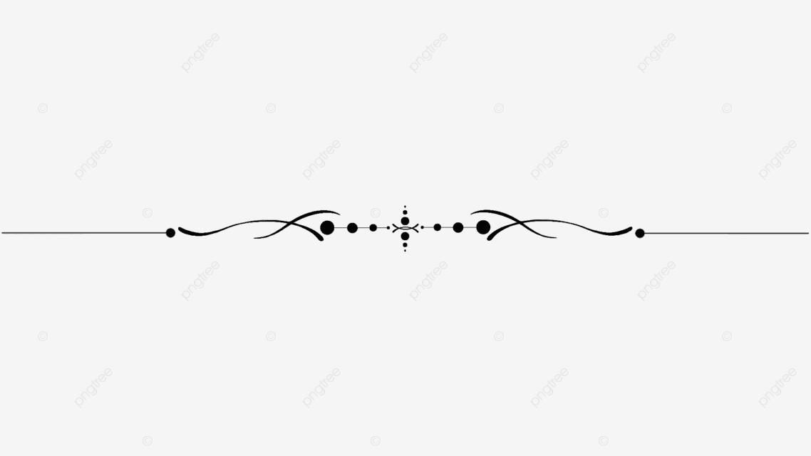

 

 
  *** As a physicist, I develop mathematical models and utilize computer simulations to study material properties for nanoelectronic applications. In addition to computational work on materials, I have also used optical interferometric microscopy to characterize the surface topography of solar cells and optical flats. Finally, I am proud to highlight my solid foundation in data analytics, using data science, machine learning, and optimization techniques throughout my academic career ***. 

  
## Technical Skills:

**Programming** : Proficient in Python, C, Mathematica, and SQL (Structured Query Language). 

Data Science : Extensive experience in data science libraries such as NumPy, Pandas, Matplotlib, Spark, Seaborn, Cufflinks, and more. 

Machine Learning :   Skilled in SciKit Learn: Regression, Classification (Random Forests, Support Vector Machines and ..), Natural Language Processing (NLP), Deep Learning and Neural Networks with PyTorch. 

Optimization : Employing the Pyomo modeling language and solvers, such as CPLEX and Gurobi, with mixed-integer linear, mixed-integer nonlinear, and linear programming.

Material Modeling : Modeling materials through HPC with VASP and Quantum ESPRESSO.

 Material Characterization : Using physical vapor deposition (PVD) for nanocoating and characterizing thin films through interferometric methods and Atomic Force Microscopy.

Mathematical Skills : Wave Theory, Matrix Mechanics, Differential Equations, Statistics, Topology, Functional Analysis, Fourier Transformations, Perturbation theory.
 

## Education:

Ph.D. in Physics: University of Antwerp, Belgium,March 2017 - October 2021 
- Thesis title: [Charge Transport in Magnetic Topological Insulators](https://repository.uantwerpen.be/docstore/d:irua:8696)

M.Sc. in Physics: Institute for Advanced Studies in Basic Science, Zanjan, Iran, September 2011 - April 2014  
- Thesis title: Studying Spin-Orbit interaction's effect on the anisotropic properties of materials.

 B.Sc. in Physics:  University of Tehran, Tehran, September 2003 - April 2008  
- Thesis title: Employing Physical Vapor Deposition (PVD) techniques, such as Sputtering and thermal co-evaporation, for nano-coating on thin films.
   
## Work Experience:

Computational Research on Materials

- **Postdoctoral Researcher**
  - *University of Antwerp, Antwerp, Belgium, October 2021 - January 2023*
    - Responsibilities:
    - Investigation of the effect of magnetic defects on topological materials' electronic properties.
    - Designing topological heterostructures with the aim of minimizing electrical energy losses.
    - Modeling and simulation of electrical resistivity at the micron and nanometer scales in Python.

- **Doctoral Researcher**
  - *University of Antwerp, Antwerp, Belgium*
  - March 2017 - October 2021
  - Responsibilities:
    - Modeling materials at the atomic level using VASP simulation package on an HPC cluster.
    - Studying how substrate and gate voltage affect quantum transport in thin films of materials.
    - Conducting numeric and analytical computations utilizing the Wolfram Language and Python.
    - Analysis, visualization, scientific writing, and publishing the result.

- **Visiting Researcher**
  - *Institute for Research in Fundamental Sciences, Iran*
  - February 2016 - February 2017
  - Responsibilities:
    - Investigation of the effects of multiple electron scattering on electric current behavior.
    - Statistical and dynamical analysis of semiconductors under thermodynamic fluctuations.

- **Visiting Researcher**
  - *Uppsala University, Uppsala, Sweden*
  - October 2015 - January 2016
  - Responsibilities:
    - Using Quantum Espresso to model 2D nanomaterials, such as self-consistent forces, stress calculations, and electronic properties such as band gap values.

### Optical Design

- **Research Engineer**
  - *University of Antwerp, Antwerp, Belgium*
  - January 2020 - March 2021
  - Responsibilities:
    - Developing alpha and beta prototypes for optical setups. For example, I designed and developed a Schlieren imaging system, which is depicted on my [YouTube channel](https://www.youtube.com/channel/UC0ghSST2dX-Yt1UBAKqMLZA).

- **Optical Design Engineer**
  - *Institute for Advanced Studies in Basic Science, Iran*
  - January 2014 - September 2015
  - Responsibilities:
    - Designing and constructing optical setups to demonstrate optical phenomena to the public, including Holography, Polarization, Interference, Diffraction, and Dispersion.

### Material Characterization, Optical Metrology

- **Research Assistance**
  - *University of Tehran, Tehran*
  - May 2008 - August 2009
  - Responsibilities:
    - Interferometric image processing to measure thin film surface roughness.
    - Atomic Force Microscopy characterization of thin films.
    - Producing optical components with λ/4 flatness and interferometric surface characterization.

## Publications:
- Dissipationless transport by design in a thin magnetic topological insulator-ferromagnetic heterostructure,   
  *Amir Sabzalipour et. al.* (In preparation).
  
- Charge transport in magnetic topological ultra-thin films: the effect of structural inversion asymmetry,   
  *Amir Sabzalipour et. al.*, Journal of Physics: Condensed Matter 33, 325702 (2021).
  
- Two distinctive regimes in the charge transport of a magnetic topological ultra-thin film,   
  *Amir Sabzalipour et. al.*, New Journal of Physics 22, 123004 (2020).
  
- Anomalous Hall effect in magnetic topological insulators: Semiclassical framework,      
  *Amir Sabzalipour and Bart Partoens*, Physical Review B 100, 035419 (2019).
  
- Anisotropic conductivity in magnetic topological insulator,  
  *A. Sabzalipour, J. Abouie, S. Abedinpour*, Journal of Physics: Condensed Matter 27, 115301(2015).
  
- Thickness and roughness measurements of Nano thin films by interference fringe intensity curve,  
  *A. Sabzalipour and M. R. Mohammadizadeh*, IJPR. 11 (1) 15 (2011).
  
- Effect of hexagonal warping on the surface conductivity of a topological insulator  
- *JA A Rezaei, A Sabzalipour, S Abedinpour*  
- The 12th Condensed Matter Conference of the Iranian Physics Society
